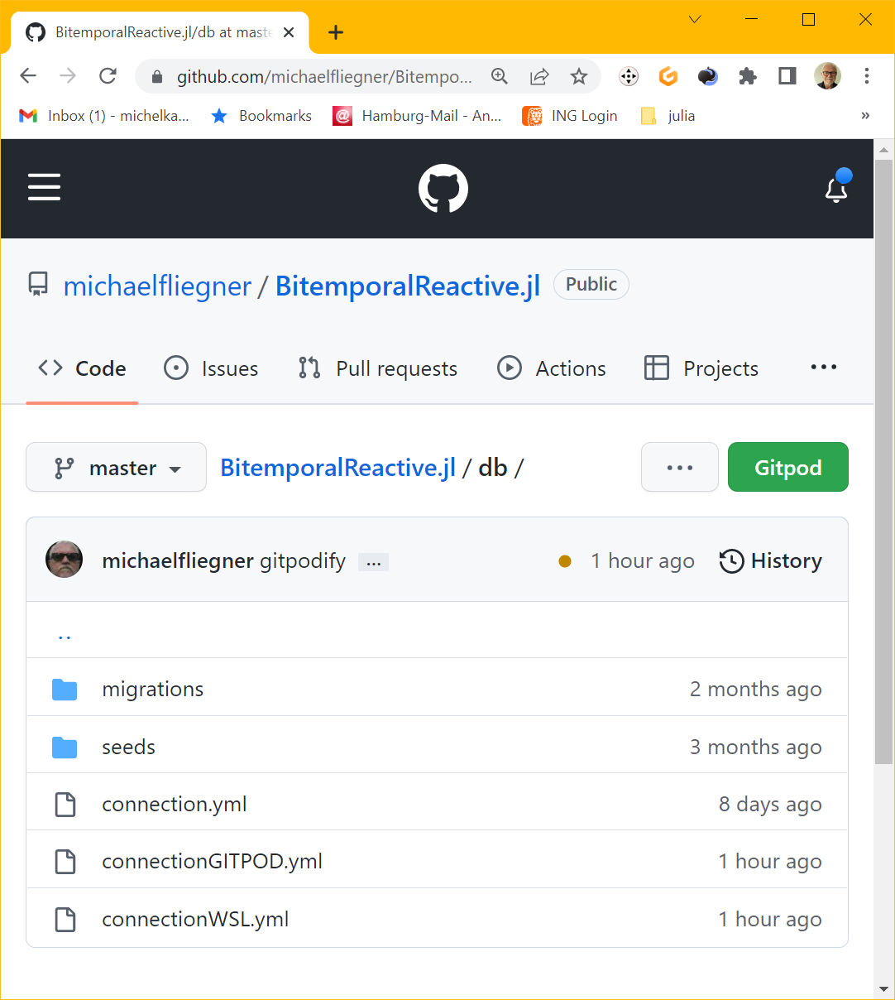
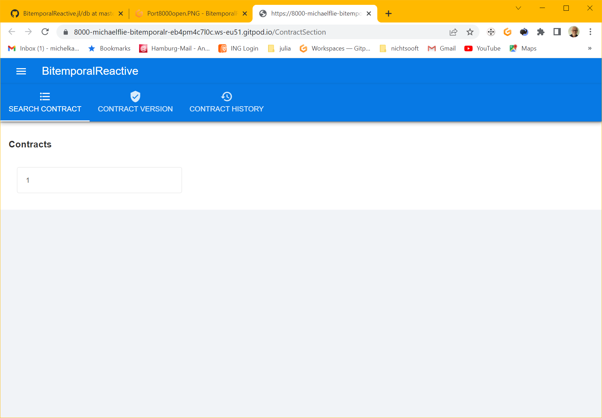
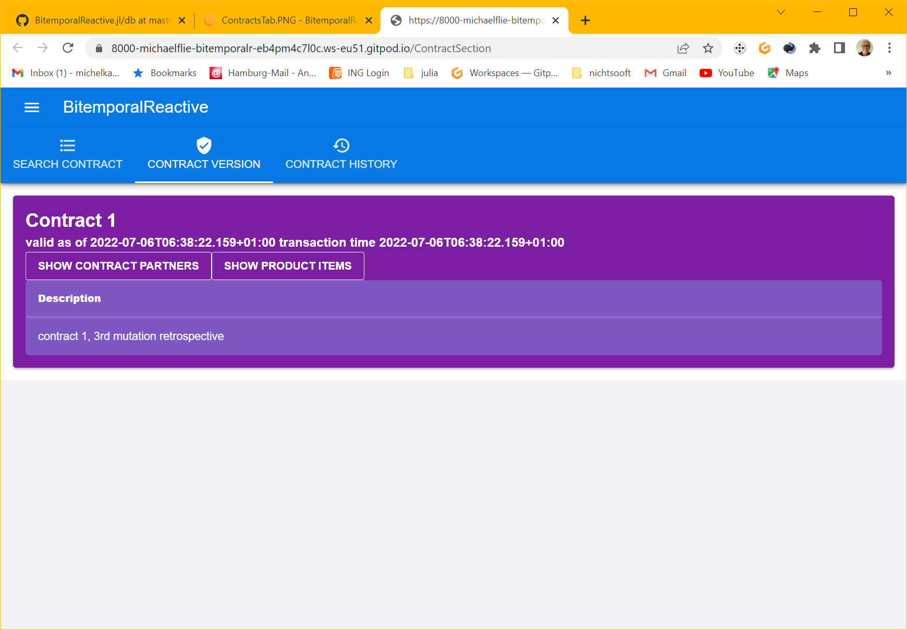
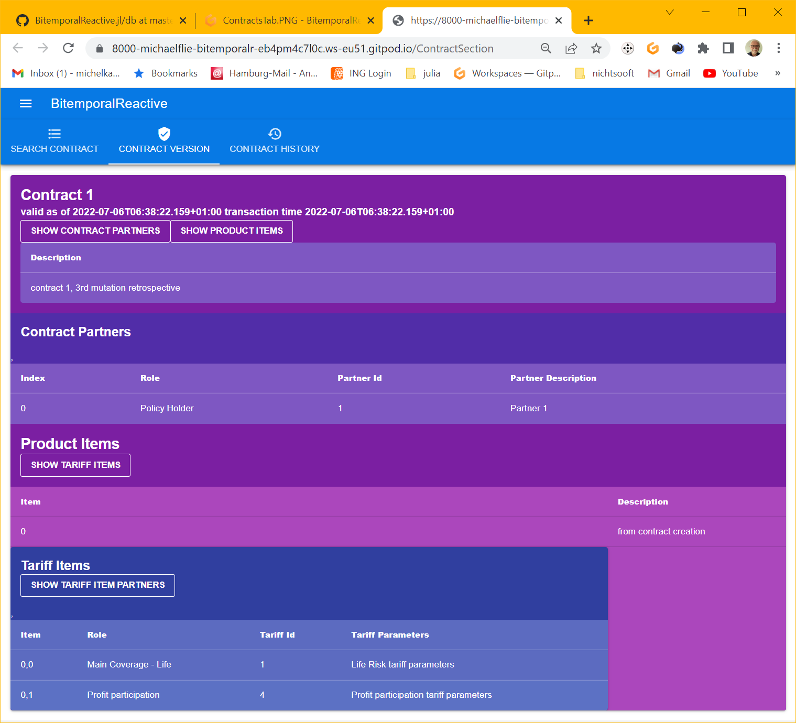
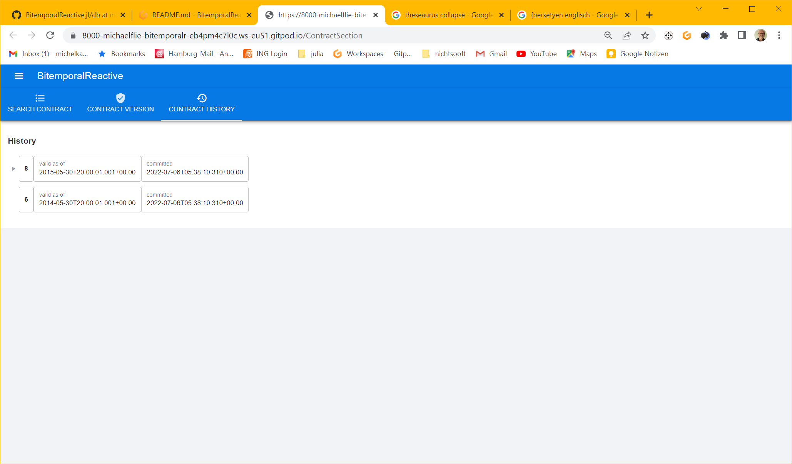

I

This is a prototype reactive web app for bitemporal data management based on [a Julia bitemporal data management API](https://github.com/actuarial-sciences-for-africa-asa/BitemporalPostgres.jl) and a UI based on [Stipple](https://github.com/GenieFramework/StippleUI.jl) and [QUASAR (where Stipple did not yet provide a solution, or I didn't find one)](https://quasar.dev/). 

Architecture is [MVVM](https://012.vuejs.org/guide/)

* BitemporalReactive connects the business model to the view model and provides event handling. 
* ContractSectionView defines the view model, the UI elements, and their data bindings.
* LifeInsuranceDataModel - an imported package - provides the business model and logic

[LifeInsuranceDataModel - the Data Model of this prototype -](https://github.com/actuarial-sciences-for-africa-asa/LifeInsuranceDataModel.jl/blob/main/src/LifeInsuranceDataModel.jl) is - as of now - all about versioning of entities and relationships for a Life Insurance app - domain specific attributes will be added when calculations will come into play.
Features are: 
- populating the database 
- displaying contract versions and history

 To populate the database use [this notebook](populateAndTest.ipynb)

# DEMO ON GITPOD NOT WORKING CURRENTLY due to error loading Genie.Webthreads: https://github.com/GenieFramework/Stipple.jl/issues/127 I would appreciate hints, on how to use WebSockets on GITPOD to circumvent this problem

Demo: Opening this project in GITPOD using the gitpod Button on the repo page 

You get an environment with a running database populated with sample data, the Webapp running and link to open a browser window.

The Browser shows the ContractSection page with Contracts Tab open and a list of one contract number.

Clicking this gives You the initial Contract Version Tab

Clicking the various show buttons give an expanded view of the current contract version

Clicking Contract History opens a tree view of the contract's mutation history, where mutations that were retrospectively altered by a mutation appear as subnodes of that mutation's node. Clicking a node show the respective version of the contract.

Dummy change

