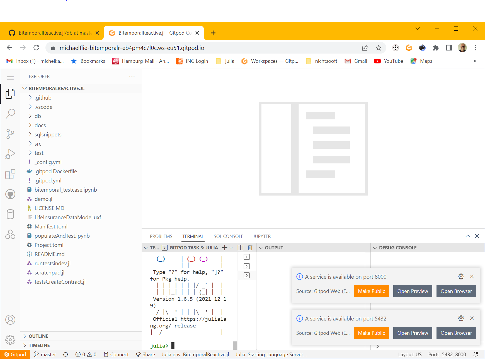

I

This is a prototype reactive web app for bitemporal data management based on [a Julia bitemporal data management API](https://github.com/actuarial-sciences-for-africa-asa/BitemporalPostgres.jl) and a UI based on [Stipple](https://github.com/GenieFramework/StippleUI.jl) and [QUASAR (where Stipple did not yet provide a solution, or I didn't find one)](https://quasar.dev/). 

### Architecture is [MVVM](https://012.vuejs.org/guide/)

* BitemporalReactive connects the business model to the view model and provides event handling. 
* ContractSectionView defines the view model, the UI elements, and their data bindings.
* [LifeInsuranceDataModel](https://github.com/Actuarial-Sciences-for-Africa-ASA/LifeInsuranceDataModel.jl) - an imported package - provides the business model and logic based on a framework
for [bitemporal data management](https://github.com/Actuarial-Sciences-for-Africa-ASA/BitemporalPostgres.jl)
* [LifeInsuranceProduct](https://github.com/Actuarial-Sciences-for-Africa-ASA/LifeInsuranceProduct.jl) - an imported package - provides actuarial computations (mostly ony a placeholder by now)

### Current features are:

- populating the database
- displaying contract versions and history

### How it works (ie: is planned to work)

The app creates or mutates bitemporal entities as of a point in reference time.
A bitemporal transaction - here also called workflow - is started in two ways:

### creation of entities initially produces
- an instance of history - the root of bitemporal entities -
- a version 
- a validity_interval

### update of entities initially creates 
- a version 
- a valididity_interval 
and references  
- a given history

While these data comprise the scaffolding needed for bitemporal tracking of mutations, components and revisions comprise the business payload, as well as subcomponents and their revisions. Thus

### mutation of Business data consists of 

-creation or invalidation of components/subcomponents together with their revisions and of
- updates of attributes of revisions

## How To Explore
 To populate the database use [this notebook](testcreatecontract.ipynb)

Demo: Opening this project in GITPOD using the gitpod Button on the repo page 

You get an environment with a running database populated with sample data, the Webapp running and link to open a browser window.

